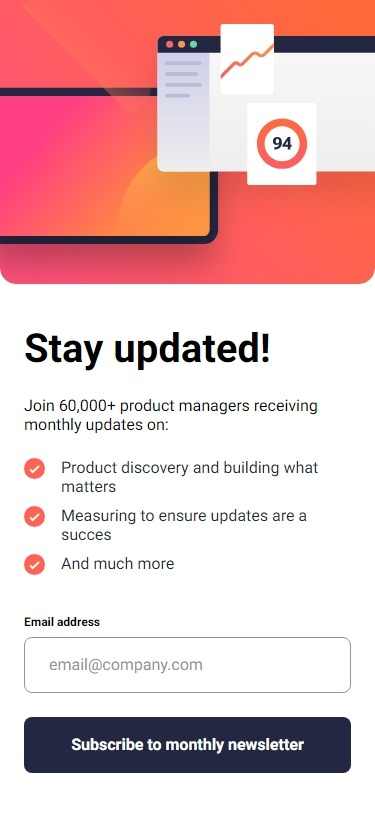
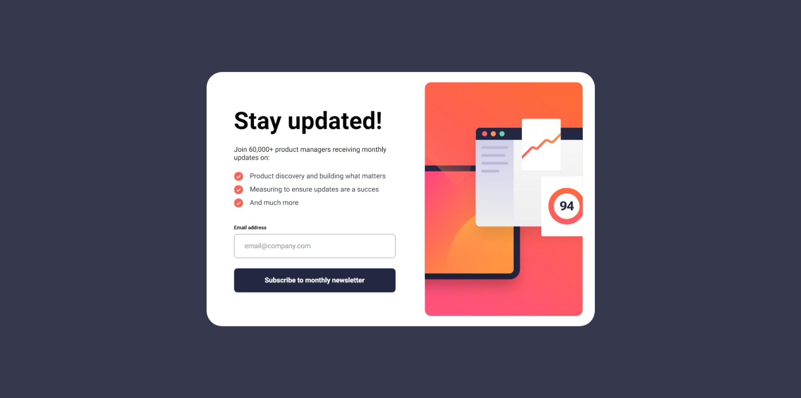

# Frontend Mentor - Newsletter sign-up form with success message solution

This is a solution to the [Newsletter sign-up form with success message challenge on Frontend Mentor](https://www.frontendmentor.io/challenges/newsletter-signup-form-with-success-message-3FC1AZbNrv). Frontend Mentor challenges help you improve your coding skills by building realistic projects. 

## Table of contents

- [Overview](#overview)
  - [The challenge](#the-challenge)
  - [Screenshot](#screenshot)
  - [Links](#links)
- [My process](#my-process)
  - [Built with](#built-with)
  - [What I learned](#what-i-learned)
  - [Continued development](#continued-development)
  - [Useful resources](#useful-resources)
- [Author](#author)

## Overview

### The challenge

Users should be able to:

- Add their email and submit the form
- See a success message with their email after successfully submitting the form
- See form validation messages if:
  - The field is left empty
  - The email address is not formatted correctly
- View the optimal layout for the interface depending on their device's screen size
- See hover and focus states for all interactive elements on the page

### Screenshot

### Links

- Solution URL: [Github](https://github.com/Qwerex56/newsletter-signnup-form)
- Live Site URL: [Netlify](https://dazzling-khapse-9ba924.netlify.app/)

## My process

### Built with

- Semantic HTML5 markup
- CSS custom properties
- Flexbox
- CSS Grid
- Mobile-first workflow
- [React](https://reactjs.org/) - JS library
- [Next.js](https://nextjs.org/) - React framework
- [SCSS](https://sass-lang.com/) - For component styles

### What I learned

This was my first time using rect and Next.js. I learned Next.js project structre, which I want to refactor, and basics of react.

### Continued development

I want to rebuild project structure.

### Useful resources

- [React](https://react.dev/) - react basics
- [Next.js docs](https://nextjs.org/) - Next.js Basics

## Author

- Website - [Adrian Czubaty](https://github.com/Qwerex56/)
- Frontend Mentor - [@Qwerex56](https://www.frontendmentor.io/profile/Qwerex56)